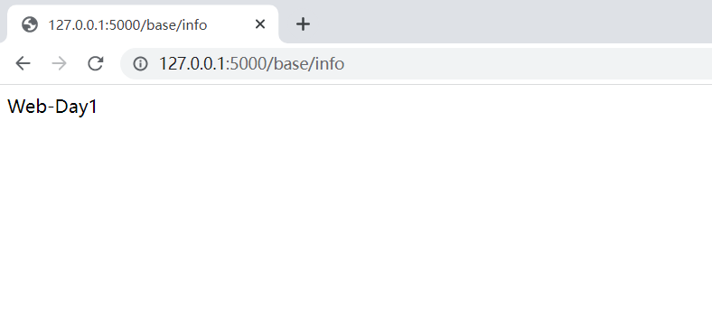

Day1:
-
使用python3.5

1、利用flask快速开发一个简易网站

pip install flask

创建manage.py
```
from flask import Flask

#Flask为一个类，对其进行实例化
app=Flask(__name__)

#创建了网址下的/base/info和函数index间的关系
#在浏览器中访问网址+/base/info，网站自动执行index函数中内容

@app.route("/base/info")
def index():
    return "Web-Day1"

if __name__ == '__main__':
    app.run()
```

<br>

利用render_template，读取templates文件夹下index.html文件
```
from flask import Flask,render_template

#Flask为一个类，对其进行实例化
app=Flask(__name__)

#创建了网址下的/base/info和函数index间的关系
#在浏览器中访问网址+/base/info，网站自动执行index函数中内容

@app.route("/base/info")
def index():
    #return "Web-Day1"
    #通过render_template，flask会自动打开文件
    #默认去当前项目目录的templates文件夹中读取
    return render_template("index.html")

if __name__ == '__main__':
    app.run()
```
修改地址和端口号
```
if __name__ == '__main__':
    app.run(host="localhost",port="3389")
```
